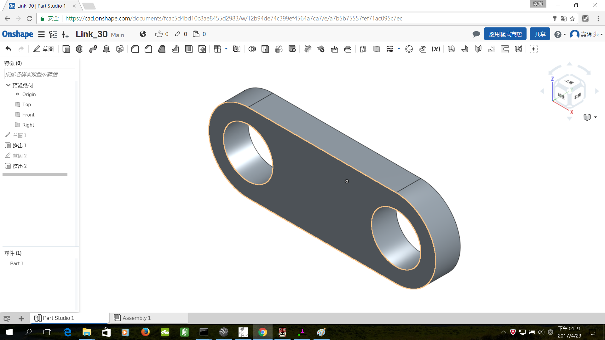
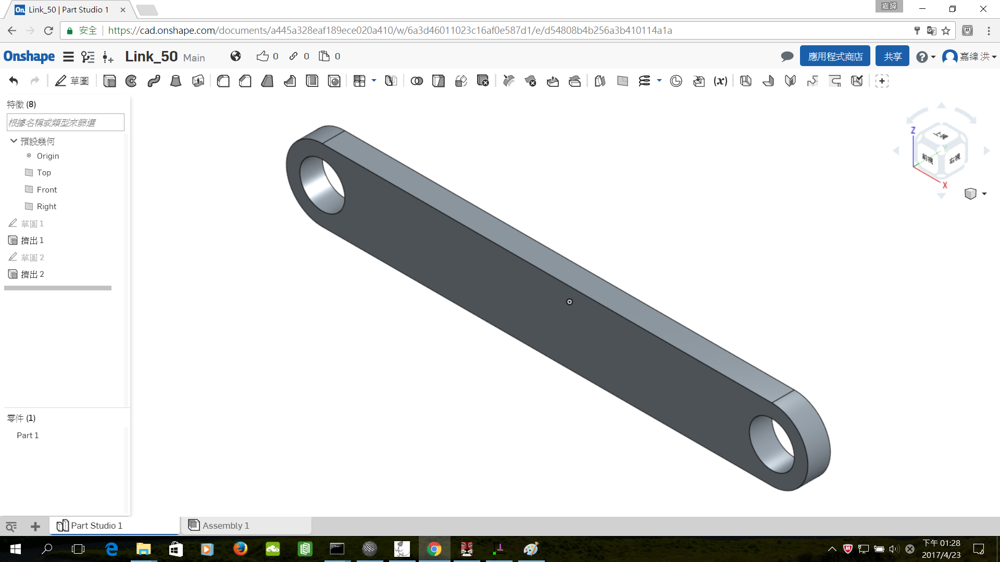
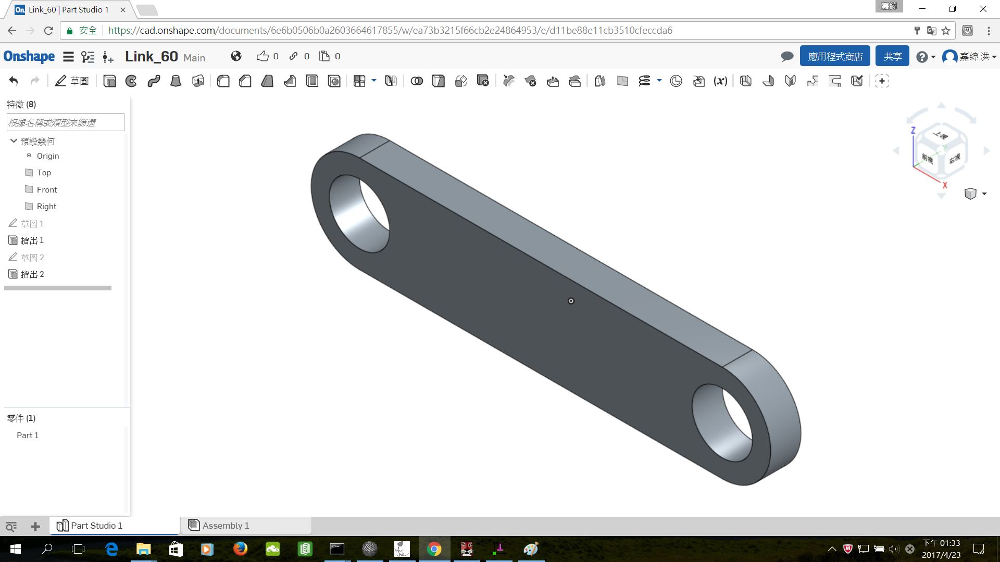

Title: Week 3
Date: 2017-03-08 22:00
Category: Course
Tags: 四連桿機構
Slug: Week 3
Author: 40423225

四連桿機構

<!-- PELICAN_END_SUMMARY -->

<h3>Solvespace</h3>

Link_30

<iframe src="../data/image/W3-1.html" width="800" height="480"></iframe>

Link_50

<iframe src="../data/image/W3-2.html" width="800" height="480"></iframe>

Link_60

<iframe src="../data/image/W3-3.html" width="800" height="480"></iframe>

<h3>Onshape</h3>

Link_30

Link_50

Link_60

<h3>影片</h3>

<iframe src="https://player.vimeo.com/video/214355570" width="640" height="480" frameborder="0" webkitallowfullscreen mozallowfullscreen allowfullscreen></iframe>

<iframe src="https://player.vimeo.com/video/214357898" width="640" height="480" frameborder="0" webkitallowfullscreen mozallowfullscreen allowfullscreen></iframe>

<h3><a href="https://vimeo.com/user60053503">個人影片區</a></h3>

<h3>心得</h3>

這是第三次上課，要開始畫圖了，畫圖的話跟之前一樣這學期的wiki要在不同的地方編輯，感覺怪怪的，但用久就習慣了。
