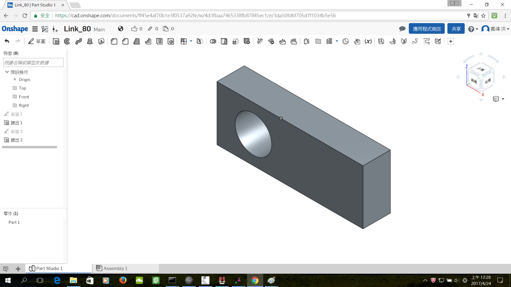

Title: 第四週
Date: 2017-03-15 22:00
Category: Course
Tags: 建立協同主機和單桿機構組件
Slug: Week 4
Author: 40423249

建立協同主機和單桿機構組件

<!-- PELICAN_END_SUMMARY -->

 <h3>建立協同主機 2017springcd_bg8</h3>
 

2017springcd_bg8: <a href="https://mde2a2.kmol.info/cdbg8">https://mde2a2.kmol.info/cdbg8</a>

<h3>Solvespace</h3>

組合

<iframe src="../data/image/W4-1.html" width="800" height="480"></iframe>

Link_70

<iframe src="../data/image/W4-2.html" width="800" height="480"></iframe>

Link_80

<iframe src="../data/image/W4-3.html" width="800" height="480"></iframe>

Pin

<iframe src="../data/image/W4-4.html" width="800" height="480"></iframe>

<h3>Onshape</h3>

Link_70

Link_80

Pin

<h3>問題</h3>

這次GitHub又發生跟上次一樣推送出現問題。

<h3>解決辦法</h3>

刪除 plugin 下的 liquid_tags 目錄

<h3>影片</h3>

<iframe src="https://player.vimeo.com/video/214359929" width="640" height="480" frameborder="0" webkitallowfullscreen mozallowfullscreen allowfullscreen></iframe>

<iframe src="https://player.vimeo.com/video/214390730" width="640" height="480" frameborder="0" webkitallowfullscreen mozallowfullscreen allowfullscreen></iframe>
